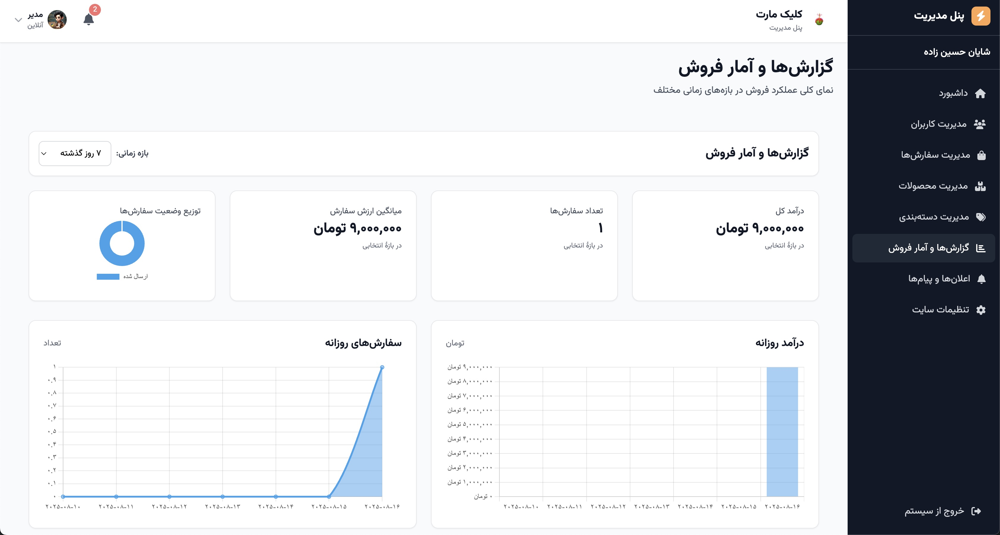
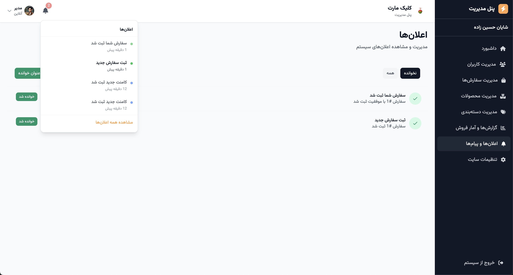
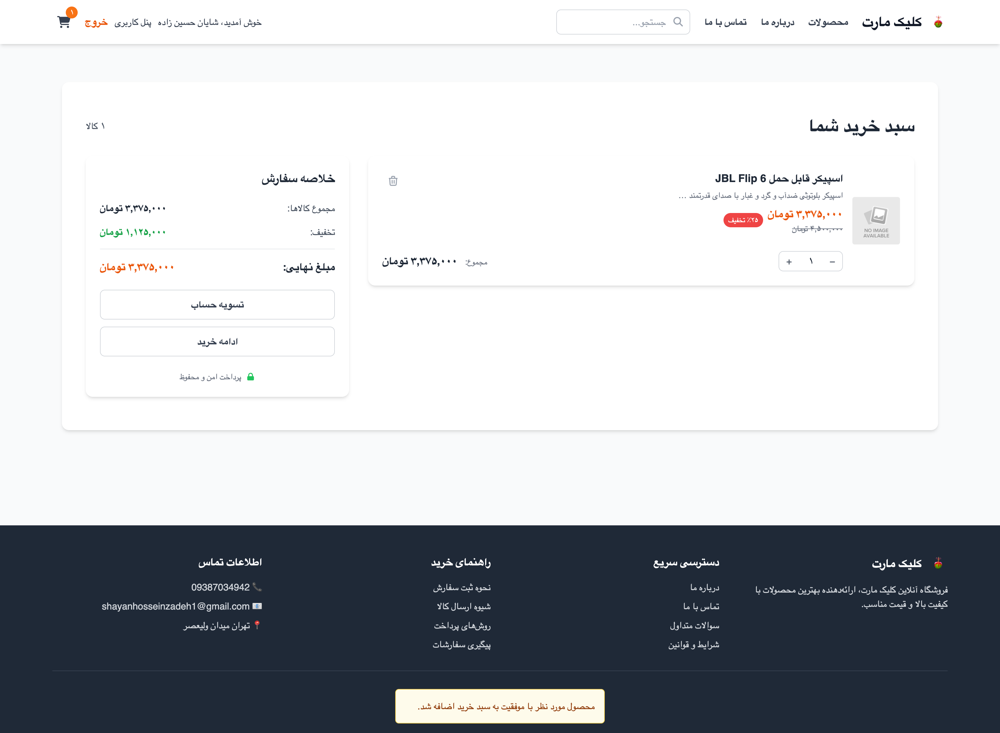
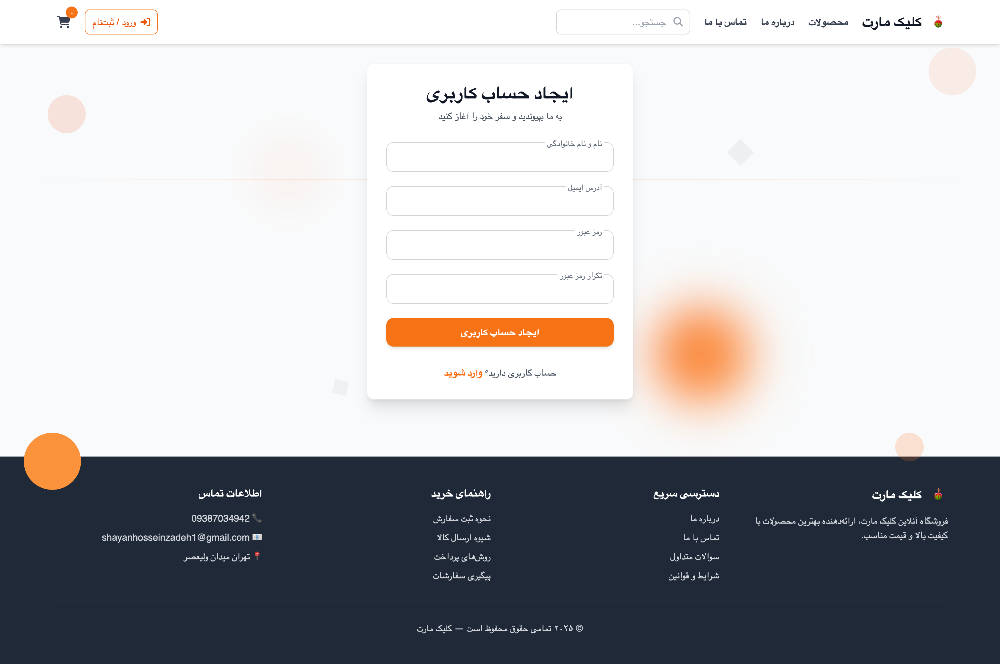
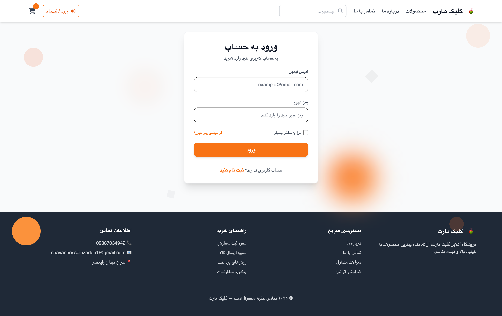

# 🛍️ Django Online Shop

A full-featured **E-commerce web application** built with **Django 4**.  
It provides product catalog, cart, orders, accounts, and **Realtime Notifications** using Django Channels.  
⚠️ The **Payment app** is disabled by default — developers can enable and integrate it with a real payment gateway if needed.  


---

## ✨ Features

- 🔔 **Realtime Notifications** (live updates for key events)
- 🗂️ **Product Catalog** with categories, rich descriptions, discounts
- ⭐ **Ratings & Reviews** for products
- 🛒 **Shopping Cart** (add/remove/update items, totals & discounts)
- 📦 **Orders** with standard order statuses
- 💳 **Payment** — *disabled by default (requires integration)*
- 👤 **User Accounts & Profiles** (signup/login, profile management)
- 🛠️ **Custom Admin Panel** (besides Django Admin) — includes:
  - **Order Management**
  - **Product and Category Management**
  - **Report with charts**
- 🖼️ **Media uploads** (product images, avatars)
- 🧰 **Seed/Demo Data** for quick testing
- 🚧 **Maintenance Mode** middleware
- 🧩 **Modular architecture** ready for extensions

---

## 🧱 Tech Stack

- **Django 4.x** (Python 3.9+)
- **Django Channels** + **ASGI/WebSockets**
- **SQLite** (default, replaceable with PostgreSQL/MySQL)
- **Tailwind templates & static assets**

---

## 🚀 Installation & Run

Clone the repository:

```bash
git clone https://github.com/your-username/django_onlineShop.git
cd django_onlineShop
```

Create virtual environment:

```bash
python -m venv .venv
source .venv/bin/activate   # On Windows: .venv\Scripts\activate
```

Install dependencies:

```bash
pip install -r requirements.txt
```

Run migrations & create superuser:

```bash
python manage.py migrate
python manage.py createsuperuser
```

Start development server:

```bash
python manage.py runserver
```

The app will be available at: 👉 `http://127.0.0.1:8000/`

---

## 📸 Screenshots

### 🏠 Admin Panel
- **Dashboard**  
  

- **User Management**  
  

- **Orders**  
  

- **Reports & Charts**  
  

- **Notifications**  
  

- **Site Settings**  
  

---

### 🛒 Shop Frontend
- **Product Detail**  
  

- **Cart**  
  

- **Sign Up**  
  

- **Login**  
  

---

## 📜 License

MIT — feel free to use and modify.

---

## 🤝 Contributing

Pull Requests and Issues are welcome!
